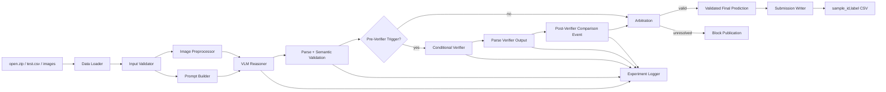
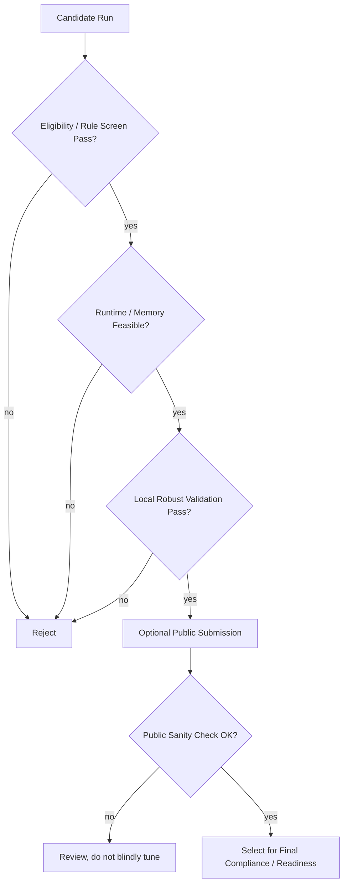

# Architecture Diagrams

## Inference Pipeline

```mermaid
flowchart LR
  A["open.zip / test.csv / images"] --> B["Data Loader"]
  B --> C["Input Validator"]
  C --> D["Image Preprocessor"]
  C --> E["Prompt Builder"]
  D --> F["VLM Reasoner"]
  E --> F
  F --> G["Parse + Semantic Validation"]
  G --> H{"Pre-Verifier Trigger?"}
  H -- "no" --> L["Arbitration"]
  H -- "yes" --> I["Conditional Verifier"]
  I --> J["Parse Verifier Output"]
  J --> K["Post-Verifier Comparison Event"]
  K --> L
  L -- "valid" --> M["Validated Final Prediction"]
  L -- "unresolved" --> X["Block Publication"]
  M --> N["Submission Writer"]
  F --> P["Experiment Logger"]
  I --> P
  G --> P
  J --> P
  K --> P
  N --> O["sample_id,label CSV"]
```

## Candidate Decision Gate

```mermaid
flowchart TD
  A["Candidate Run"] --> B{"Eligibility / Rule Screen Pass?"}
  B -- "no" --> X["Reject"]
  B -- "yes" --> C{"Runtime / Memory Feasible?"}
  C -- "no" --> X
  C -- "yes" --> D{"Local Robust Validation Pass?"}
  D -- "no" --> X
  D -- "yes" --> E["Optional Public Submission"]
  E --> F{"Public Sanity Check OK?"}
  F -- "no" --> G["Review, do not blindly tune"]
  F -- "yes" --> H["Select for Final Compliance / Readiness"]
```
